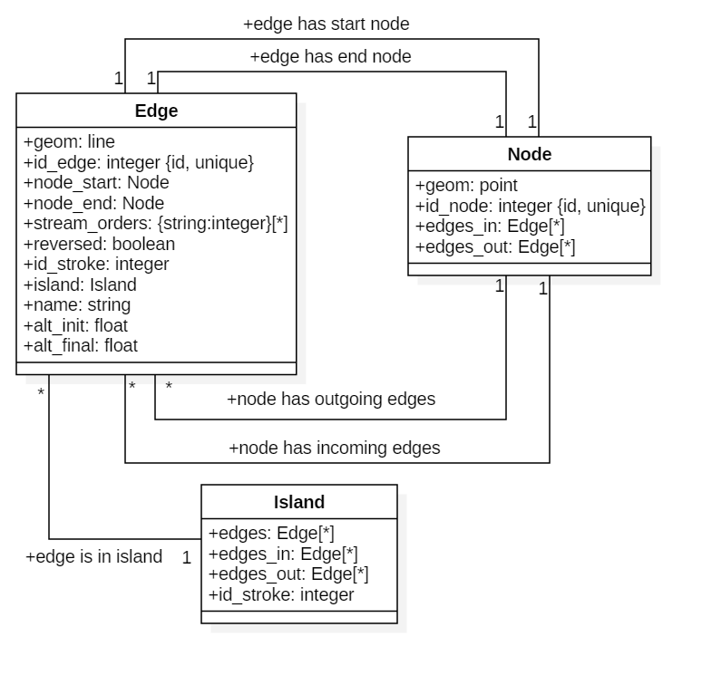
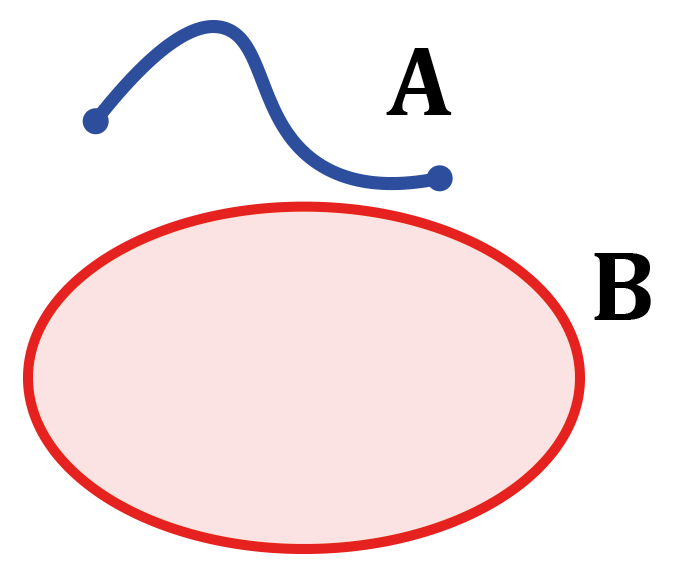
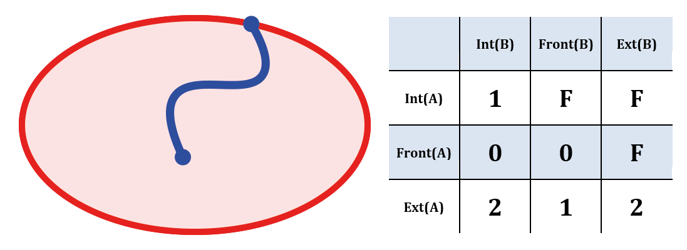
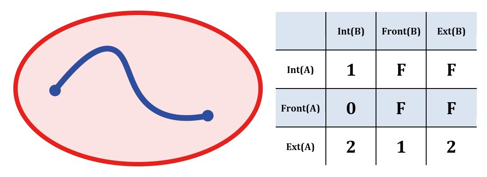
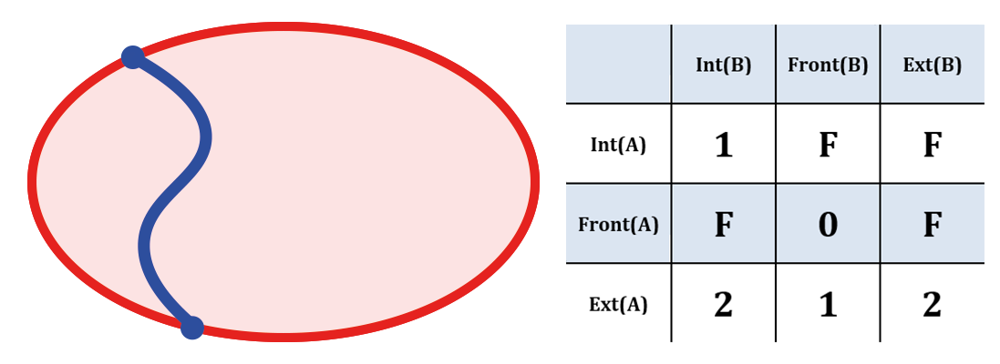
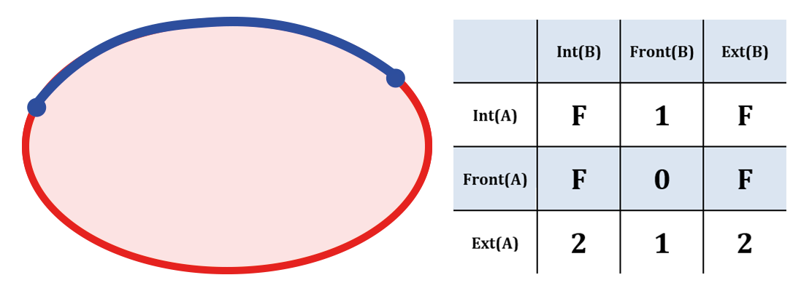

Approach & Strategy
================

General strategy
--------------

Hy2roresO is a QGIS plugin developed in Python 3.6 for QGIS 3.0.
The implemented algorithm is iterative. The algorithm goes through the river network starting from the sources and down to the sinks.
The orders computation relies on instances of classes specifically designed for the plugin. They will be detailed further in the documentation.

**This section aims to present the main hypotheses** we were led to make to enable the orders algorithm to work on complex networks that have singular configurations such as islands, when the theoretical algorithms of all three orders expect a network shaped as a binary tree (*see the Introduction of the User* documentation_ *about the Strahler, Shreve and Horton algorithms*). However, such networks are not the river structures that exist in reality. The goal of the hypotheses made for the implementation of our algorithm is to adapt the general spirit of each order algorithm defined only for binary trees to the more complex reality.

.. _documentation: ../user-docs/presentation.html

Input data
------------

The data and chosen options the plugin needs as input are the orders to compute and the layer of the river network. The network layer must be a linear vectorial layer. The network **should not contain artificial zones** such as irrigation zones, since such configurations are not specifically handled by the algorithm and the result may be meaningless. Forks of streams that do not occur in an island (two or more streams exiting an island), immediately at the sources (multiple sources exiting a single node) or at the sinks of the network (deltas) may also introduce mistakes in the strokes computation, that might spread into the downstream network calculation afterwards (see the upstream length criteria for strokes computation below). 

Be aware that **the layer must also not contain duplicated geometries**. Duplicated geometries are hard to notice since you cannot see them simply by displaying the layer, and they significantly alter the orders computation. Duplicated geometries are processed as two streams connected to the same nodes, but they do not make up an island (islands have a non-zero area). Thus duplicated geometries artificially increase the Strahler and Shreve orders at each node, completely distorting the results.

The algorithm 
--------------

Classes
~~~~~~~~~~~~

Instead of working directly on the features of the layer or using an external library, the plugin implements three classes instantiated using the layer features that make travelling through the network easy (and independent from external parts).

The algorithm sets 3 classes for each geometry type: *Edge* (lines of the networks), *Node* (connecting points) and *Island* (edges delimiting a surface, face of the network). Their attributes register their interconnection in the layer network.

   
   Class diagram of the algorithm; the methods are not listed here
    
Initialization
~~~~~~~~~~~~

At the beginning of the process, a method initializes each feature of the layer as an edge and its initial and final nodes, with all their attributes.

The objects instantiated are stored in two lists that are passed as arguments to all the other methods.

Correct stream direction
~~~~~~~~~~~~

Methods were implemented to check and correct the stream direction. If the option in the launcher interface is checked, directions are tested.  

The checking method is called if the checkbox in the plugin, that asks the user if he wants to be proposed some streams to reverse, is checked. 

A stream direction is suspected to be incorrect if it meets one of the two following **criteria**:
 * The altitudes are known (fields name filled by the user in the launcher) and **the initial altitude is lower than the final altitude** of the edge;
 * A connected node is not a source or a sink (degree larger than 1) and has **only incoming edges or only outgoing edges**.
 
The suspicious edges are displayed thanks to a dialog box to the user, who can choose for each edge if they want to reverse it or not by knowing the direction of connected streams and the structure of the network. Obviously, amongst all the suspicious edges, only the edges approved by the user will be reversed for the orders computation.

If the edge is reversed, the information is stored as a boolean attribute of the object and a field can be added to the input layer to restore this information to the user (option in the launcher).

.. note::
   Changing the direction of the stream will not change the geometry of the feature of the input layer. It will only change the attributes of the object instantiated from the layer feature, that only exist within the plugin.

Sources and sinks detection
~~~~~~~~~~~~

The plugin detects the sources and sinks of the network. The user does not have to indicate them to the algorithm. 

A source is a node that has no incoming edges. The outgoing edges of the sources are stored into a list that is passed as an argument to the method which implements orders computation. The initialize the iterative process of orders computation.

A sink is a node that has no outgoing edges. Their detection is not useful to the Hy2roresO algorithm.

.. note:: 
   It is important that directions are corrected before this step, as missing a source will affect the whole branch connected to the source edge.

Island detection
~~~~~~~~~~~~

Islands are the most frequent structures a real network may have that differ from and that will alter the orders. We call an island the structure induced by the split of a stream into two or more arms that join back downstream. If the regular algorithm is systematically applied as if the network was a binary tree, the streams that meet again at the end of the island will increase the order. This is an unwanted effect, as this increase is meaningless. It does not relate an upgrade in the hierarchy or a flow increase: no affluent actually meets the stream, the stream meets itself. Therefore, the order should be the same as the upstream order. Thus islands need to be identified, or more accurately edges that delimit islands need to be identified, so that two edges that are actually part of an island do not induce an increase of the order when they meet. The regular algorithms do not apply to edges that belong to islands.

.. note:: 
   All three orders under study are affected by islands, as Strahler and Shreve orders increase when rivers cross and Horton is based on the value of the Strahler order.
   
A great improvement proposed by Hy2roresO in comparison to plugins existing so far is the detection of islands, that enables specific process. 

The edges that belong to islands are detected as such by the algorithm, and will be processed differently from the other edges when computing their orders.

**An island is a face of the network.** The steps of island detections are the following:
 * Polygonize the network (create the polygons that correspond to the faces of the graph). We re-used the code of the *Polygonize* QGIS tool found in the toolbox.

.. note:: 
   Let's underline that underground features are not differentiated from features on other levels, and thus might induce faces that are not islands in reality. Once again, be aware of man-made structures in the network.

Single islands (one face of the graph) or complex islands (a succession of adjacent faces) can be processed similarly. Therefore edges are identified as belonging to one common island whether they delimit a single island or the belong to a complex island. Hence the following steps:
 * Merge the polygons to transform adjacent single islands into one complex island (one bigger polygon).
 * Detect the edges that belong to the islands. For this step we studied the topological relations between
   the edges and the islands. We defined our own topological request using a QGIS method *relate()* and
   DE-9IM matrices.

   
   Figures of DE-9IM used in the island detection algorithm.

Then:
 * Store the edges in a list of lists of the edges of each island. 
 * Instantiate Island objects from each list of edges corresponding to each (complex) island. The Island objects instantiated are stored as attributes of the Edge objects that belong to the islands. When computing the orders, testing whether this attribute is null or refers to an island tells if the edge belongs to an island and informs what process to apply on the edge.
 
Successive islands are yet another type of topological relation between islands, that also has to be detected. Successive islands are not adjacent, and are not separated by any edge (that does not belong to an island). Therefore successive islands do not have regular outgoing edges (except the last one of the series) and thus have to be processed all at once.

 * Unlike complex islands, this structure can not be detected using merging. Another specific topological request is defined, still with the *relate()* function and a DE-9IM matrix.
 * The lists of edges belonging to complex (or single) islands that are successive are concatenated, so that the orders computation method will read the edges as making up one island and the appropriate process will be applied to the whole island.
 
Orders computation
~~~~~~~~~~~~

The user can choose to compute the Strahler order, the Shreve order and/or the Horton order in the launcher.
The orders are defined in the user documentation_. 
 .. _documentation: ../user-docs/presentation.html
 
The algorithm computes the orders, store them as attributes of the Edge objects specifically instantiated and add a column for each chosen order to the input layer. 
 
Computing meaningful orders requires to take the specificities of the network structure into consideration. Islands are processed specifically. We present in this section some hypotheses we made and the process we chose for cases handled distinctively.
 

Strahler, Shreve and Horton stream orders
++++++++++++++++

The algorithm starts from the sources and travels through the river network down to the sinks.

The main steps of the algorithm are the following:
 * The iterative process is initialized by setting the Strahler and Shreve orders of the source edges to 1. Each source edge also defines a new stroke (except sources that are in islands).
 * For each edge, if all the incoming edges have already been processed, the edge can be processed.
 * If the edge is not in an island, its orders are computed following the rules defined for each order. Its stroke is computed by selecting which of its upstream edges the edge continues the best. *(See more on the strokes below.)*
 * If the edge is in an island, all the edges of the island the edge belongs to are processed. Then all the outgoing edges of the island are processed. *(See more about that below.)*
 * The Horton order is computed after all the edges have been processed for Strahler order computation. Indeed the Horton order is based on the Strahler value and its computation needs all the Strahler orders to be computed and all the strokes to be built beforehand.

The algorithm runs while there are edges left to process, or until the number of edges to process does not decrease between two iterations (meaning that the edges left to process can not be processed). Edges cannot be processed if they form a loop, as each edge needs all the other edges of the loop to be processed first before they can be processed.

 * Potential edges that form a loop are detected. The order computation of the loop is forced. All the edges of the loop are given the same order, which is the order computed standardly from the orders of all the incoming edges of the loop (that are not in the loop). The process is then executed again to compute the orders of the potential edges downstream of the loop that can finally be computed now their incoming edges have been processed.

Conditions to elaborate the strokes
++++++++++++++++

Each source gets an identifier of stroke. Then, arriving in an intersection (node), the id of the outgoing edge is chosen according to this 4 conditions [TOUYA2007]_ :
 - the name of the outgoing edge exists and is exactly the same as one of its incoming edges
 - the incoming edge that has the highest flow (if it exists in the data). This condition is not handled in the algorithm.
 - one of the incoming stroke is more than 3 times longer than the other incoming strokes
 - the stroke that creates an angle that is the closest to 180 degrees (more continuous)

After defining the strokes, we can attribute for each edges of a stroke the same Horton stream order, which is the maximum of the Strahler order of the edges of the stroke. The main stroke gets therefore the maximum Strahler stream order, and so one until each stroke is treated.

When handling an island, the stroke is calculated according to the conditions of name and length of the incoming strokes. The island is isolated and the outgoing edge is set to be attributed a stroke identifier from one of the incoming edges.
Then, every edge defining the island is given the identifier that was given to the outgoing edge. The island is completely part of the stroke this way, which was one of our suppositions (the island is there seen as a node).

When there is a delta or more than one outgoing edge from an island, the stroke is determined as the same stroke from the incoming edge. 

.. [TOUYA2007] http://recherche.ign.fr/labos/cogit/publiCOGITDetail.php?idpubli=4181&portee=labo&id=1&classement=date&duree=100&nomcomplet=Touya%20Guillaume&annee=2007&principale=

Stream orders and strokes in islands
++++++++++++++++

In islands, the order of each edge is the maximum of the orders of its incoming edges. It guarantees the order won't increase at each river crossing, and the order still gets larger if larger streams meet the island, which is intuitively expected by the user. 

All the edges in the island belong to the same stroke. This decision respects most aspects of a stroke. An island respects good continuity (in general) with one of its incoming edges and one of its outgoing edges. If you look at the network from afar, you want to draw a line that goes through the island and connects its two ends. There is at first sight no reason why you should pick one edge of the island over the others (in general). This is particularly obvious for single island, that have only one incoming edge and one outgoing edge. The two edges of the arms are not two rivers but two arms of the same river, therefore they are part of the same stroke. Another criterion in favour of this decision is that a stroke is supposed to start from a source and end either at a sink or at a river crossing. If only one edge of the island was chosen to define the stroke, the other edges would consequently define their own stroke that would not be connected to a source (in general).

There are two downsides to this. The first is that the strokes are supposed to be linear geometries in many situations they are used in. Islands break the continuous single line. The second downside is that the length of the stroke is not clearly defined anymore. Again, this could be a setback in many situations. It actually affects Hy2roresO. Indeed the strokes are defined using a criterion on the upstream length of the stroke (amongst other criteria, *more on strokes construction below*). Adding the lengths of all the strokes of the islands together is meaningless realistically. To overcome this issue, edges that belong to an island are stored separately from the rest of the network, and merged back with the main stroke after each edge has been processed and associated with a stroke, and before computing the Horton order. 

The stroke of the island edge is based on the incoming edges of the island (the edges that enter the island but that do not delimit the island nor are enclosed in the island). 
The determination of the stroke of the island edges is based on two criteria:
 * If one of the incoming edges splits in two entering the island, it probably is the stream delimiting the island and thus the best continuity. If there is the only splitting edge, its stroke is the stroke of the island.
 * Otherwise, the longest upstream stroke is the stroke if the island.

.. note:: 
   An angle criterion would be a possible improvement. However, it requires to define the angle between a linear edge and the island surface. See more about that in the Perspectives_.
   
.. _Perspectives: ../dev-docs/perspectives.html

Stream orders and strokes exiting islands
++++++++++++++++

Coming soon!

Update of the table
-----------------

The last part of the algorithm concerns the output data. This part creates new columns of attributes to the layer, which are the different orders calculated, a column 'reversed' if it has been chosen and a column with the identifier of the stroke if the Horton stream order has been calculated.
	
If you have chosen to get a new output layer with all the data, then you will get one with the data from the former layer and the new columns. Else the algorithm will update your input layer by adding these new columns.

#TODO: Finally, if there is already a column named like the ones that will be created, the user will be asked if he wants to keep the former column or if he wants to overwrite it.
