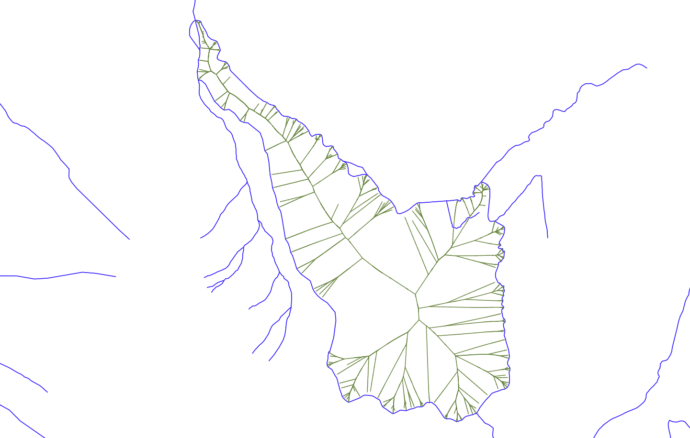

Perspectives
============

Hy2roresO deals with a whole bunch of cases that can happen with natural hydrological networks. However, there still are some things that can be realized to improve the plugin.

* Strokes can be defined using the criterion that their name should remain the same after a river crossing. Rivers were indeed named according to rather intuitive criteria of continuity that strokes should meet. However, toponyms can be written in many different ways in the database. As for now, the algorithm only tests the strict equality of the strings. Therefore, any typing error, any upper/lower case difference, etc. will not allow to match the names. **Tests on toponym similarity** could improve this criterion. Methods of distance measurements between toponyms exist and could be implemented to improve the pairing of names. Beware also that strings such as "NR" or "N/A" that indicate unknown toponyms will be detected as identical names. We chose not to implement a criterion to eliminate this case as writing conventions in the database may differ. Frequently used conventions should be implemented for **better matching of the names and improved strokes computation**. *(See* `Approach & Strategy`_ *.)*

.. _`Approach & Strategy`: ../dev-docs/approach_strategy.html

* Forks in the network are not managed by the algorithm. Forks induce an error on the length of the stroke and generate mistakes when computing the strokes.

* One thing that can be done is to create fictive network inside the islands, for example by using a **skeleton** of the geometry of the island. This could for example **improve the definition of strokes entering and exiting an island**, especially it the island is curved. It also would grant the strokes a linear geometry (without the forks inside the islands), which is commonly expected of a stroke.

   
   Example of a skeleton built inside an island, from Voronoï polygons

* The method *interpolateAngle()* from the class **QgsGeometry** was briefly studied to better deal with curved islands by interpolating the angle between the island and its incoming edges, or the island and its outgoing edges. Maybe this could lead to a better process for the **strokes**. As for now, there is indeed no consideration of angle between the island and its connected edges to define the strokes, which is a major weakness. **The angle between an edge and an island** is a notion yet to define. 

* The **flow** of each edge is theoretically the second criterion to determine strokes, however it is not handled in our algorithm since flow data is rarely available. Adding a condition on it to the code could be beneficial for a **better determination of the strokes**. However testing such a field automatically implies that the field must follow a given format, which is tricky to generalize and is hardly reliable due to the diversity of database specifications (especially if strings are allowed).

* The plugin already tests if edges seem to be **directed correctly**, based on their altitudes and the direction of their connected edges. The detection algorithm would be improved by adding an **angle criterion** to the tests.

* The plugin does not test whether **a field already exists** in the attribute table of the input layer. If an existing field is named like the field to create, it will be overwritten. Warning the user and asking whether they want to overwrite the existing field or rename the field to create can be an improvement.
