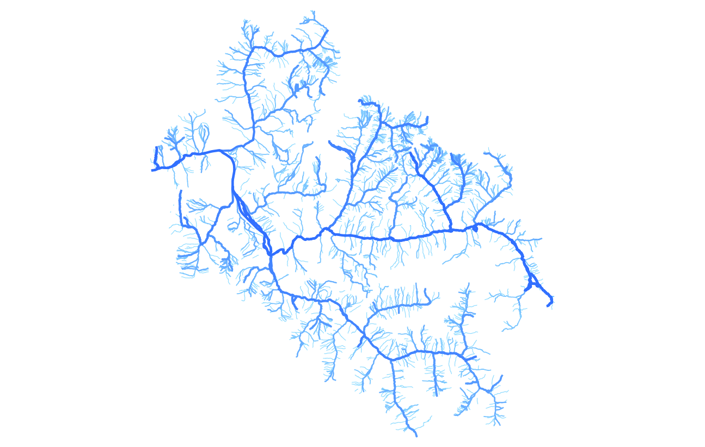

# Hy2roresO
Hy2roresO is a QGIS Plugin that is able to compute various stream hierarchisation orders, such as Strahler order, Horton order, Shreve order, in any hydrological network.

The plugin works with QGIS 3.0, and is developed with Python 3.6.

## Description
Website : [https://mgaudin.github.io/Hy2roresO/](https://mgaudin.github.io/Hy2roresO/ "Hy2roreso's website")

Documentation : [http://hy2roreso.readthedocs.io](http://hy2roreso.readthedocs.io "Hy2roreso's documentation")

## Preview
#### The plugin
Opening the plugin, you will have to choose essential parameters for the process : the layer and the orders you want to generate.

You can then choose optional parameters to try to get a more realistic hierarchisation of your network. You can finally save the output layer and choose to reverse some edges that may not have the good direction.
During the process, you may be asked if you want to reverse some edges in case you checked the corresponding box in the interface.

#### The results
After processing, you will be able to display the orders of your network, from Strahler to Horton and Shreve.
Here is an example of how the algorithm handles the Strahler order when arriving in a complex island (succession of adjacent islands) :

Finally, this plugin can process in every hydrological network, with every natural configurations. With the orders, we can access to new information about the network under study. Here is an example of the Horton example, which can display the strokes and so the most important rivers in a network (the bolder the more important) :

## What do I need?
To process the plugin, you must have QGIS 3.0 and Python 3.6.
As for the data, you will only need a shapefile (.shp) of a stream network. It will then appear in the selection of layers at the beginning of the process.

## Credits

This work was realized during a project by three students of the Ecole Nationale des Sciences Géographiques (ENSG).

Michaël Gaudin (<michael.gaudin@ensg.eu>)

Alice Gonnaud (<alice.gonnaud@ensg.eu>)

Guillaume Vasseur (<guillaume.vasseur@ensg.eu>)

We thank very much our supervisor during this project, Cécile Duchêne, researcher. We also thank Guillaume Touya, Head of the COGIT Department at the IGN for his help.

Credits to the QGIS plugin "Strahler" and v.stream.order from GRASS
