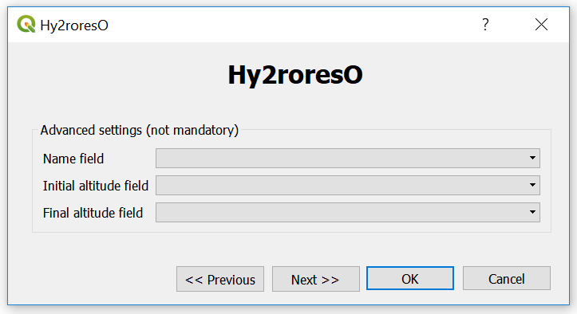

How to...?
==========

Preparation of the process
-------------

To use Hy2roresO properly, make sure you have opened the vector layer corresponding to the network you want to analyse.
Your layer must not contain artificial networks (such as irrigation zones), and must not have duplicated geometries, for the algorithm to run properly. If you have duplicated geometries in your layer, please refer to the Documentation_ from QGIS to eliminate them.
 .. _Documentation: https://docs.qgis.org/2.8/en/docs/user_manual/processing_algs/qgis/vector_general_tools/deleteduplicategeometries.html
 
The output of the plugin is the input layer with new fields corresponding to the different orders.

To open the Hy2roresO plugin, go to the *Extension* menu, then find Hy2roresO and open it. You can also find it thanks to its icon : |icon|

.. note:: You do not need to be in editing mode to use Hy2roresO, it occurs automatically by processing.

Step 1 : essential parameters
-------------

You will find yourself in front of a window :

   
   First window of the plugin

The first parameters you must enter are :
 - the layer on which you want to apply the algorithm
 - the stream orders you want to get thanks to the plugin: Strahler, Shreve and Horton (you can see the description of each of these orders here_)
 .. _here: ../user-docs/presentation.html

Click on **Next** to go to the next parameters.

Step 2 : optional parameters 
---------------

You can now enter more optional parameters to specify the names of the fields corresponding to the **name of the river**, the **initial altitude** and the **final altitude** of each section of the network.

 
   Second window of the plugin

These parameters are optional : if they are not specified, the algorithm will still run, but may be less efficient because these parameters can be a key for a better hierarchisation.

Click on **Next** to get to the next step.

Step 3 : process and output
----------------

On this window you can :
 - authorize the algorithm to reverse streams that may not be entered well and therefore cause some mistakes in the attribution of the orders; reversed streams are reversed for the computation but the input layer remains unchanged (checked initially)
 - add a boolean field *reversed* to the layer you are applying the algorithm on, it indicates whether the streams were reversed during the algorithm (checked initially)
 - save the output layer, and choose the path where you want to save this layer
 

 
   Third window of the plugin

Once you have finished, you can click on **Next** for more information about the elaboration of the plugin.

You can finally click on **OK** to run the algorithm.

*Note : You can click on OK right from the start once you have selected a layer and at least one order to calculate. The algorithm will run with the default settings. You can also come back to the previous step whenever you want by clicking on Previous.*

During the algorithm
~~~~~~~~~~~~~~

During the process of the algorithm, if you have chosen to authorize the algorithm to reverse some streams, you may find this type of window : 

.. figure:: ../_static/dialog.png
   :align: center
   
   Window asking if the user wants to reverse a feature

Streams that are suspected to be uncorrect are streams connected to a node that has several incoming edges but no outgoing edge, or several outgoing edges but no incoming edge; or streams whose initial altitude is lower than final altitude (if altitude fields are known).

You can reverse the feature which is being processed or not. You can also ask to reverse them all or to let them all at their initial state, knowing the number of streams that could be reversed.

*Note : The algorithm does not modify the layer in itself by reversing some features, it is only for its good process!*

End of the algorithm
-----------------

The algorithm is finished when you meet this final window : 

.. figure:: ../_static/sucess.png
   :align: center
   
   Final window

.. note:: Do not panic if QGIS *does not respond* during the process, since two steps are particularly long : the island detection and the update of the layer with the writing of the new fields. The plugin is still running.

