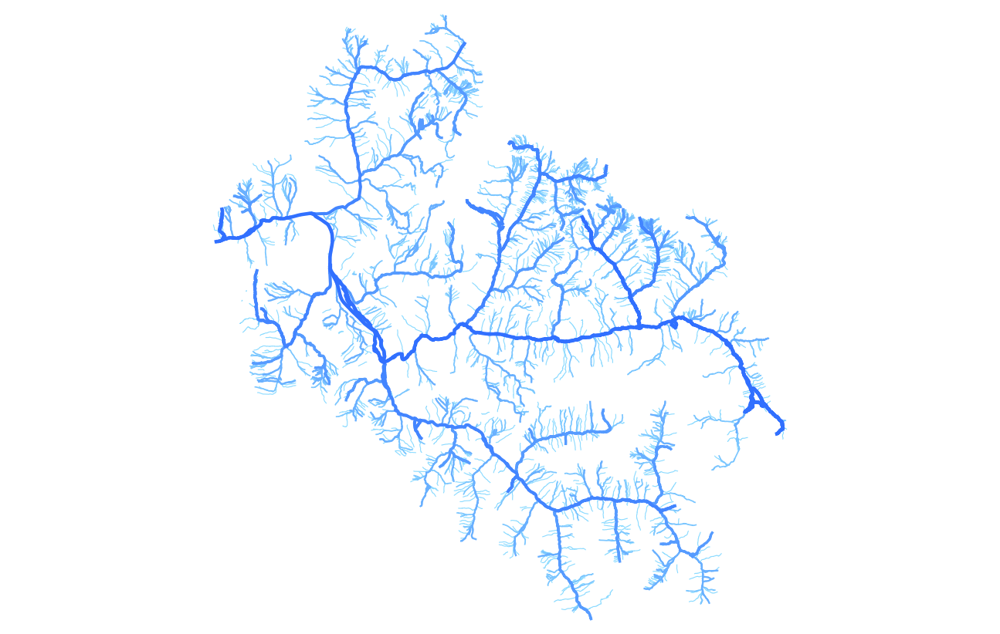

Results
=================

Hy2roresO handles a multitude of configurations in hydrological networks, which is a novelty comparing to former plugins from GRASS or QGIS which were less precise or even wrong.

To begin with, the "Strahler" QGIS plugin handled, as its name recalls, only the Strahler stream orders of a network by selecting its sink, with several mistakes when processing in specific configurations.
The GRASS plugin (v.stream.order) handled the Strahler and Shreve stream orders, however the results were not good. There was also a section to handle the Horton stream order, but it was not implemented.

Hy2roresO gives the input layer Strahler, Shreve and Horton stream orders and also takes into account wrong directions from some edges and computation of the strokes, which is a major improvement comparing to what existed before.

Let's have a look at the results Hy2roresO creates with a few examples of different configurations in hydrological networks.

Simple network 
-------------------

In former plugins processing the different orders at stake, this configuration has never been a problem, and Hy2roresO also delivers a right result for these simple networks.

   +------------------------------------------------------------+------------------------------------------------------------+   
   | .. image:: ../_static/results/Hy2roresO_arbre_strahler.png | Strahler stream order on a simple network                  |
   +------------------------------------------------------------+------------------------------------------------------------+
   | .. image:: ../_static/results/Hy2roresO_arbre_shreve.png   | Shreve stream order on a simple network                    |
   +------------------------------------------------------------+------------------------------------------------------------+
   | .. image:: ../_static/results/Hy2roresO_arbre_horton.png   | Horton stream order on a simple network                    |
   +------------------------------------------------------------+------------------------------------------------------------+

   
Lonely island
------------------

Hy2roresO handles lonely island so as the outgoing edge has the same order than the incoming edge, which was not the case in former plugins. This way, the orders do not increment dramatically each time an island is met by the algorithm.

   +-------------------------------------------------------------+------------------------------------------------------------+   
   | .. image:: ../_static/results/Hy2roresO_simple_strahler.png | Strahler stream order on a simple island                   |
   +-------------------------------------------------------------+------------------------------------------------------------+
   | .. image:: ../_static/results/Hy2roresO_simple_shreve.png   | Shreve stream order on a simple island                     |
   +-------------------------------------------------------------+------------------------------------------------------------+
   | .. image:: ../_static/results/Hy2roresO_simple_horton.png   | Horton stream order on a simple island                     |
   +-------------------------------------------------------------+------------------------------------------------------------+

Complex island
-------------------

A succession of adjacent islands is what we call a complex island. When processing previous plugins, this part has always been an issue. With Hy2roresO, it is handled correctly so as the orders do not increase dramatically too and stay right.

   +---------------------------------------------------------------+------------------------------------------------------------+   
   | .. image:: ../_static/results/Hy2roresO_complexe_strahler.png | Strahler stream order on a complex island                  |
   +---------------------------------------------------------------+------------------------------------------------------------+
   | .. image:: ../_static/results/Hy2roresO_complexe_shreve.png   | Shreve stream order on a complex island                    |
   +---------------------------------------------------------------+------------------------------------------------------------+
   | .. image:: ../_static/results/Hy2roresO_complexe_horton.png   | Horton stream order on a complex island                    |
   +---------------------------------------------------------------+------------------------------------------------------------+

Whole network
------------------

Hy2roresO handles every edge of the network, while previous plugins struggled managing to process them all.

   +-----------------------------------------------------------+------------------------------------------------------------+   
   | .. image:: ../_static/results/Hy2roresO_tout_strahler.png | Strahler stream order on a whole network                   |
   +-----------------------------------------------------------+------------------------------------------------------------+
   | .. image:: ../_static/results/Hy2roresO_tout_shreve.png   | Shreve stream order on a whole network                     |
   +-----------------------------------------------------------+------------------------------------------------------------+
   | .. image:: ../_static/results/Hy2roresO_tout_horton.png   | Horton stream order on a whole network                     |
   +-----------------------------------------------------------+------------------------------------------------------------+

Computation of the strokes
------------------

Unlike the two other plugins, Hy2roresO deals with the strokes too, and computes them. Therefore, we are able to compute the Horton stream order on networks too. Thaks to this order, one can see the main branches according to this order, as shown in this result obtained thanks to Hy2roresO :

   
   Application of the Horton stream order on a network. The bolder the stroke the higher the Horton order.

Comparison between the three existing plugins
------------------

There are lots of differences between the three plugins.
Here is a :download:`PDF file <doc/Comparison_plugins_order.pdf>` comparing them all. 
